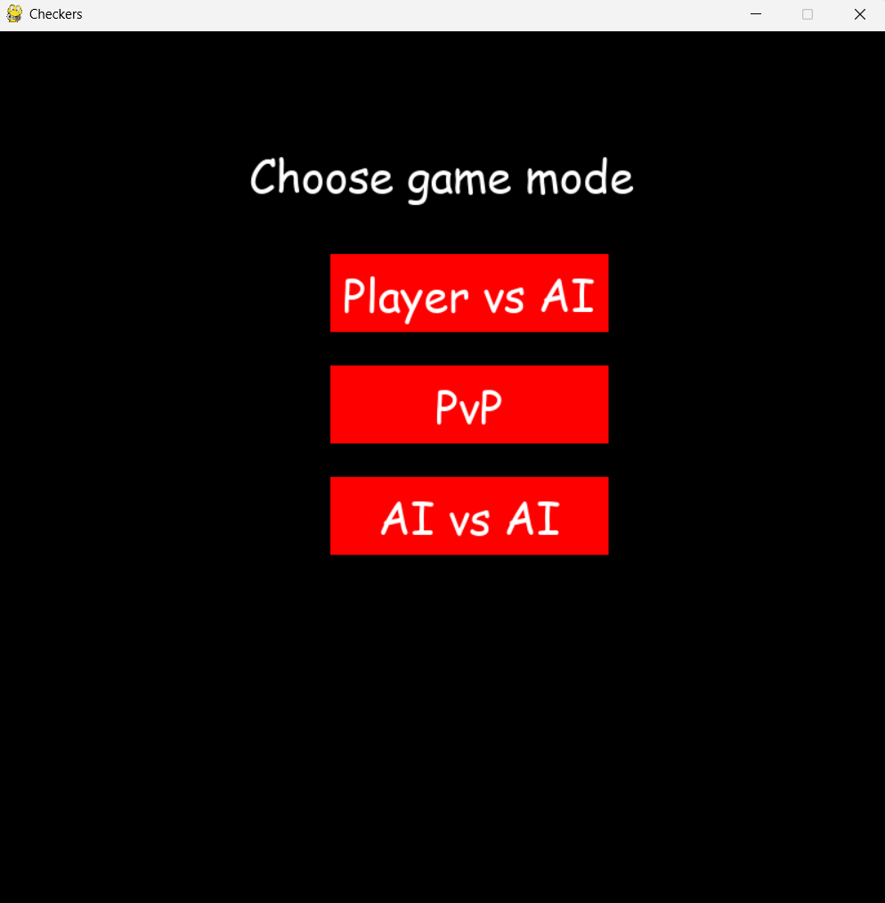
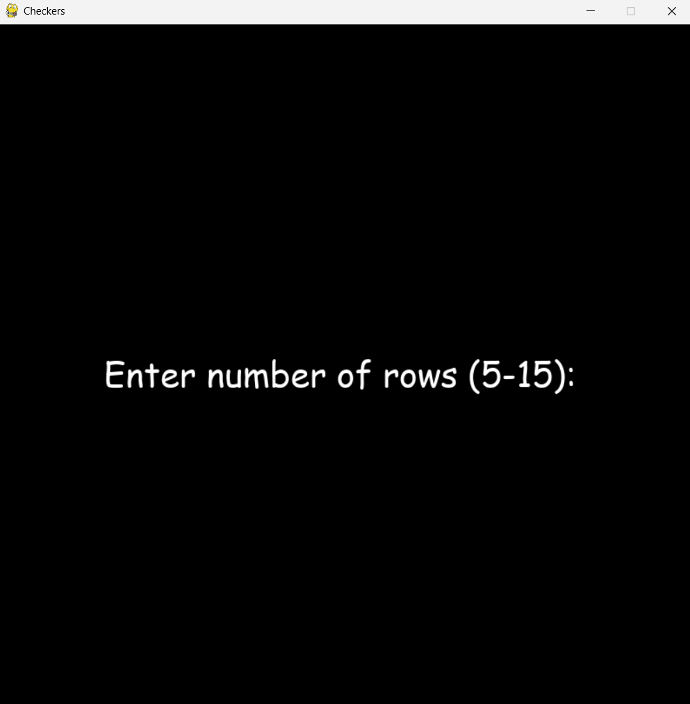
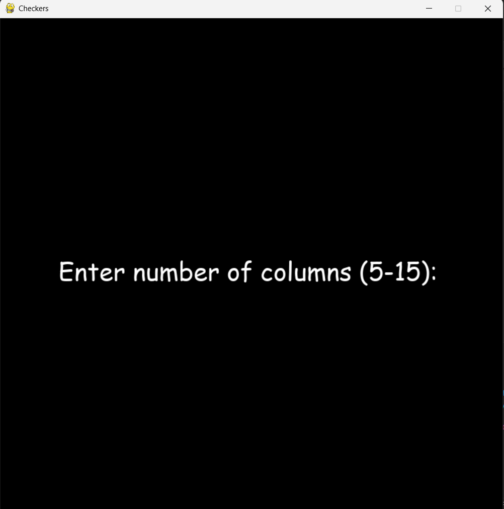
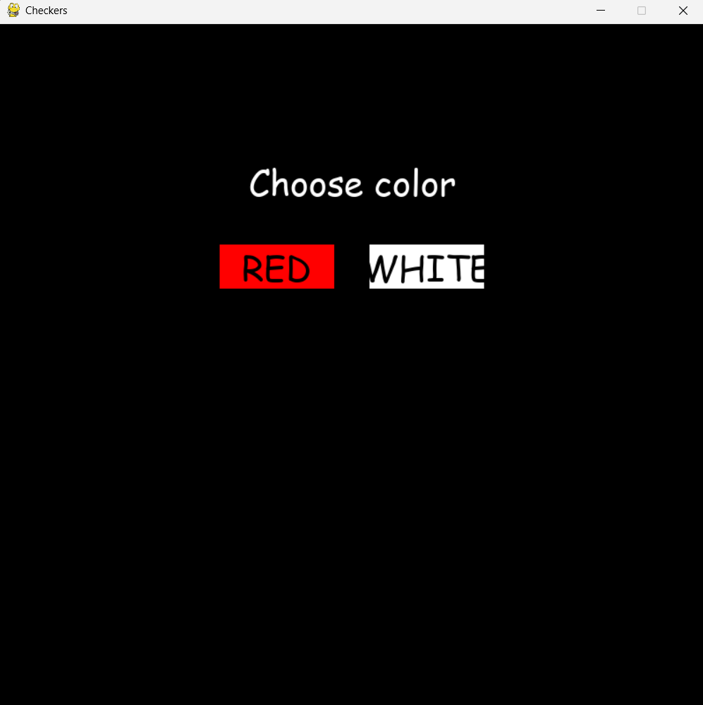
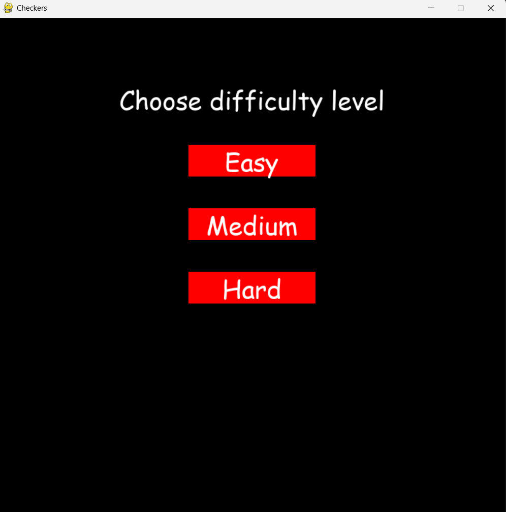
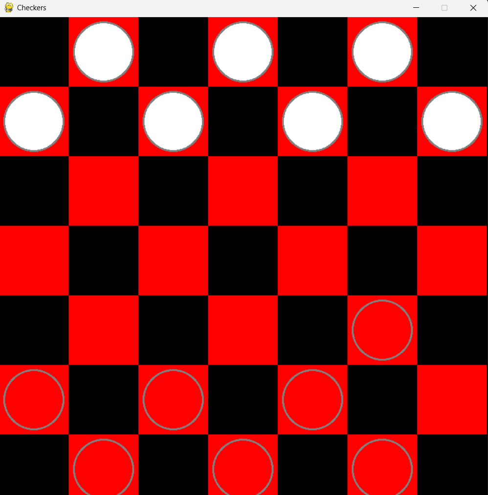
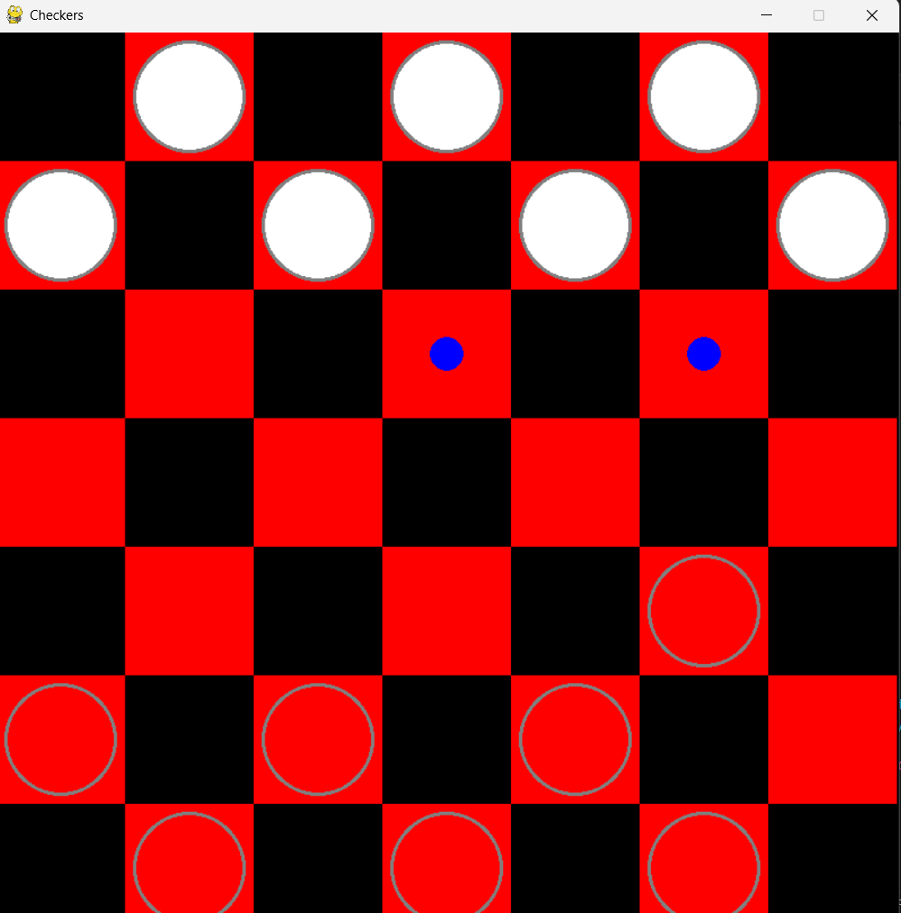

# Checkers AI Game

## Description
This project is a computer game of "Checkers" with AI. There are three game modes:
1. Player vs AI
2. Player vs Player (PvP)
3. AI vs AI 

---

## Features
- Graphical interface using "pygame"
- AI analyzing moves using "minimax"
- Support for game rules, including mandatory moves
- Visual effects when moving checkers

---

## Game rules
- The player chooses which pieces to play with, and the AI ​​plays the other one.
- Pieces can move diagonally forward.
- When a piece reaches the last row, it becomes a "king" and can move backward.
- The game ends if "there are no more possible moves" for someone, regardless of whether they are blocked or run out of pieces or if "the same position on the board is repeated three times", i.e. looping.

---

## Screenshots
















---

## Technologies
- Python 
- Pygame
- Minimax с alpha-beta pruning

---

## Installation
1. Install dependencies:
   python -m pip install -r requirements.txt

2. Starting the game:
   python -m src.main	

---

## Project Structure

```text
Checkers/
├── screenshots/
│   ├── 1.png
│   ├── 2.png
│   ├── 3.png
│   ├── 4.png
│   ├── 5.png
│   ├── 6.png
│   ├── 7.png
│   ├── 8.png
│   └── 9.png
├── src/
│   ├── __init__.py
│   ├── algorithm.py
│   ├── board.py
│   ├── constants.py
│   ├── game.py
│   ├── main.py
│   └── piece.py
├── tests/
│   ├── __init__.py
│   ├── test_algorithm.py
│   ├── test_board.py
│   ├── test_game.py
│   ├── test_piece.py
├── requirements.txt
├── .gitignore
└── README.md
```

---

## Menu navigation
1. Select one of the three game modes.
2. Select the board size by entering numbers from the keyboard [5, 15]. First we enter a row, then a column.
3. Select which color to play with.
4. When the game is over, the console displays the winner or tie.

---

## Controls
- Click on a checker to select it.
- Click on a valid cell to move a checker.

---

## Author
- Martin Hristov - https://github.com/MartinHristov105